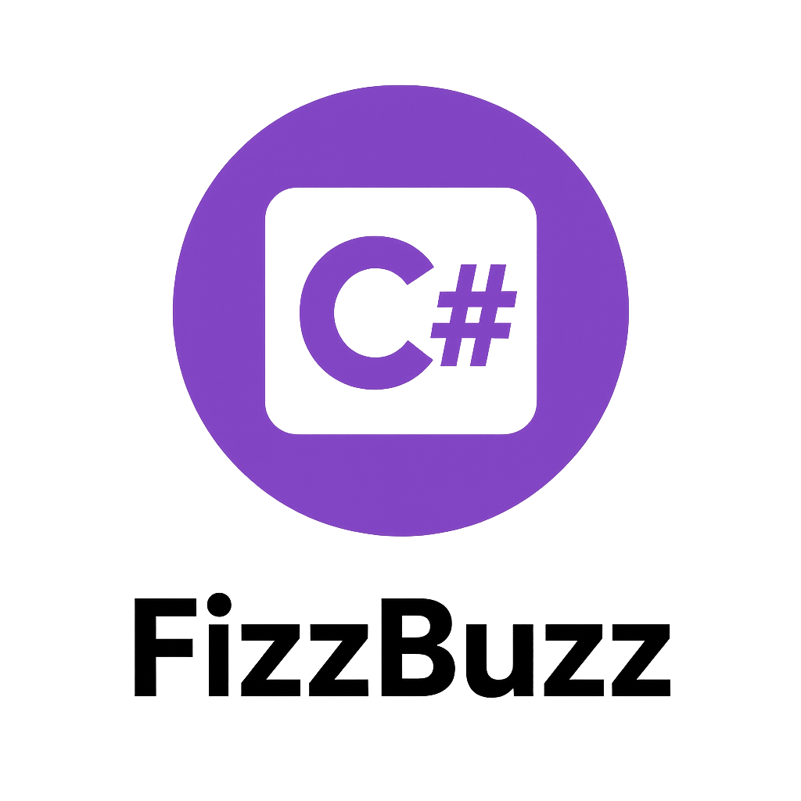

<!-- Improved compatibility of back to top link -->
<a id="readme-top"></a>

<!-- PROJECT SHIELDS -->
[![Contributors][contributors-shield]][contributors-url]
[![Forks][forks-shield]][forks-url]
[![Stargazers][stars-shield]][stars-url]
[![Issues][issues-shield]][issues-url]
[![License][license-shield]][license-url]


<!-- PROJECT LOGO -->
<br />
<div align="center">
  <a href="https://github.com/CodecoolGlobal/generalized-fizzbuzz-csharp-Zergi0">
    
  </a>

  <h3 align="center">Generalized FizzBuzz (C#)</h3>

  <p align="center">
    A customizable and extendable implementation of the FizzBuzz kata in C#.
    <br />
    <a href="https://github.com/CodecoolGlobal/generalized-fizzbuzz-csharp-Zergi0"><strong>Explore the docs »</strong></a>
    <br />
    <br />
    <a href="https://github.com/CodecoolGlobal/generalized-fizzbuzz-csharp-Zergi0/issues/new?labels=bug&template=bug-report---.md">Report Bug</a>
    ·
    <a href="https://github.com/CodecoolGlobal/generalized-fizzbuzz-csharp-Zergi0/issues/new?labels=enhancement&template=feature-request---.md">Request Feature</a>
  </p>
</div>


<!-- TABLE OF CONTENTS -->
<details>
  <summary>Table of Contents</summary>
  <ol>
    <li><a href="#about-the-project">About The Project</a></li>
    <li><a href="#built-with">Built With</a></li>
    <li><a href="#getting-started">Getting Started</a></li>
    <li><a href="#license">License</a></li>
  </ol>
</details>


<!-- ABOUT THE PROJECT -->
## About The Project

This is a **C# project** for creating a generic version of the popular kata *FizzBuzz*.  

The project is designed to be easily expandable with features such as:
- Customizable outputs
- Customizable rules
- Ability to create entirely new rules

<p align="right">(<a href="#readme-top">back to top</a>)</p>


<!-- BUILT WITH -->
## Built With

* [![C#][C#]][C#-url]
* [![NUnit][NUnit]][NUnit-url]

<p align="right">(<a href="#readme-top">back to top</a>)</p>


<!-- GETTING STARTED -->
## Getting Started
### Run the project
1. **Clone the project:**
```bash
git clone https://github.com/CodecoolGlobal/generalized-fizzbuzz-csharp-Zergi0.git
```
2. **Navigate to project and build**
```bash
cd CodeCool.FizzBuzzCooperation
```
```bash
dotnet build
```
3. **Run the project**
```bash
dotnet run
```
### Run the tests
- Once you have downloaded the project in the previous section:
1. **Navigate to the tests and build it**
```bash
cd CodeCool.FizzBuzzCooperationTest
```
```bash
dotnet build
```
<p align="right">(<a href="#readme-top">back to top</a>)</p>


<!-- LICENSE -->
## License

Distributed under the MIT License. See `LICENSE` for more information.  
*(Adjust if you’re using a different license.)*

<p align="right">(<a href="#readme-top">back to top</a>)</p>


<!-- MARKDOWN LINKS & IMAGES -->
[contributors-shield]: https://img.shields.io/github/contributors/CodecoolGlobal/generalized-fizzbuzz-csharp-Zergi0.svg?style=for-the-badge
[contributors-url]: https://github.com/CodecoolGlobal/generalized-fizzbuzz-csharp-Zergi0/graphs/contributors
[forks-shield]: https://img.shields.io/github/forks/CodecoolGlobal/generalized-fizzbuzz-csharp-Zergi0.svg?style=for-the-badge
[forks-url]: https://github.com/CodecoolGlobal/generalized-fizzbuzz-csharp-Zergi0/network/members
[stars-shield]: https://img.shields.io/github/stars/CodecoolGlobal/generalized-fizzbuzz-csharp-Zergi0.svg?style=for-the-badge
[stars-url]: https://github.com/CodecoolGlobal/generalized-fizzbuzz-csharp-Zergi0/stargazers
[issues-shield]: https://img.shields.io/github/issues/CodecoolGlobal/generalized-fizzbuzz-csharp-Zergi0.svg?style=for-the-badge
[issues-url]: https://github.com/CodecoolGlobal/generalized-fizzbuzz-csharp-Zergi0/issues
[license-shield]: https://img.shields.io/github/license/CodecoolGlobal/generalized-fizzbuzz-csharp-Zergi0.svg?style=for-the-badge
[license-url]: https://github.com/CodecoolGlobal/generalized-fizzbuzz-csharp-Zergi0/blob/main/LICENSE

[C#]: https://img.shields.io/badge/C%23-239120?style=for-the-badge&logo=c-sharp&logoColor=white
[C#-url]: https://learn.microsoft.com/en-us/dotnet/csharp/
[NUnit]: https://img.shields.io/badge/NUnit-00A300?style=for-the-badge&logo=.net&logoColor=white
[NUnit-url]: https://nunit.org/
